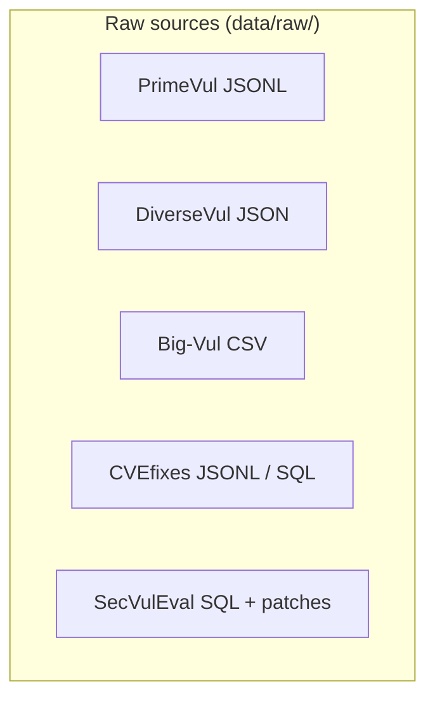
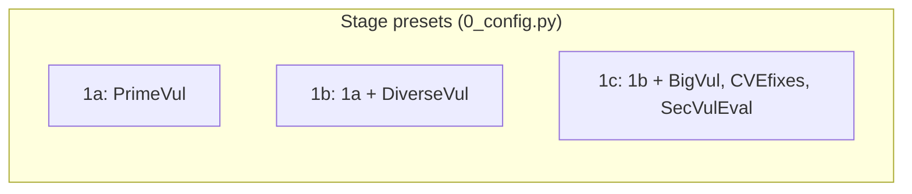
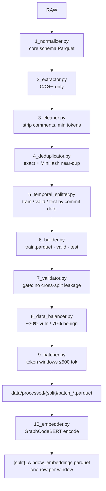
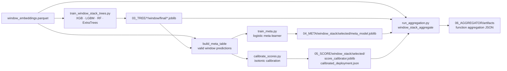
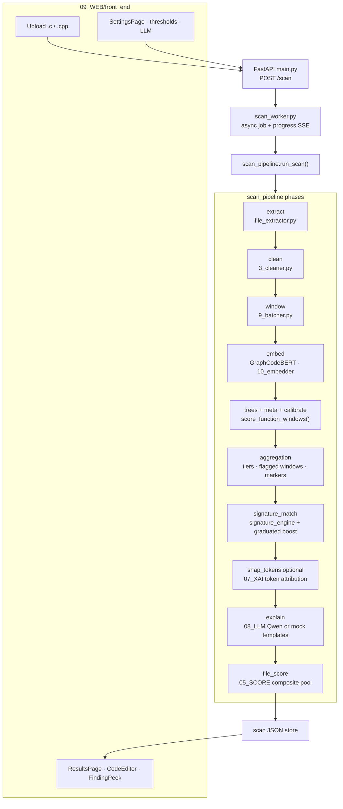
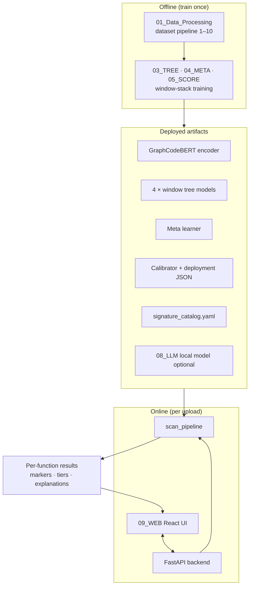

# Vulnera — ML Pipeline Architecture

End-to-end view of how training data becomes models, and how uploaded C/C++ is scanned in the web app.

**Deployed detector:** window-stack ensemble (4 tree models → meta learner → isotonic calibration → function aggregation → signature fusion → optional LLM explanations).

---

## 1. Training data pipeline (`01_Data_Processing`)

Raw vulnerability corpora are normalized, cleaned, split, windowed, and embedded. Orchestrated by `dataset_pipeline/run_pipeline.py` (steps 1–9) and `10_embedder.py` (step 10).

| Step | Output                        | Role                                              |
| ---- | ----------------------------- | ------------------------------------------------- |
| 1–6  | Whole-function Parquet splits | Labeled functions with metadata                   |
| 7    | Pass/fail gate                | Blocks pipeline on split leakage                  |
| 8    | Balanced splits               | Class ratio control                               |
| 9    | Window shards                 | Overlapping token windows per function            |
| 10   | Window embeddings             | One GraphCodeBERT vector per token window         |

Encoder checkpoint: `02_ML_Model/graphcodebert-base`. Config: `dataset_config.yaml` → `10_embedder`. Root manifest: `vulnera.yaml`.

Function-level risk is **not** computed by pooling embeddings. It is derived later by max-pooling **window probabilities** (see §2).

---

## 2. Window-stack model training (`03_TREE` → `06_AGGREGATOR`)

The production stack trains on **unpooled window embeddings**, then aggregates window probabilities to function level.

Orchestrator: `06_AGGREGATOR/training_scripts/run_window_stack_pipeline.py`

**Per-window scoring math:**
`embedding → 4 tree probs → meta learner → isotonic calibrator → window_prob`

**Per-function scoring math:**
`window_probs → composite max-pool + spread uplift → function_score_calibrated → deployment tiers (safe / review / vuln)`

Configs: `aggregator_config.yaml`, `meta_config.yaml`, `score_config.yaml`.

---

## 3. Runtime inference — web scan (`09_WEB`)

Upload path mirrors the training preprocessors, then reuses the trained window stack.

**Model bundle** (`model_runtime.get_model_bundle()`): loads 4 window trees, meta model, calibrator, and deployment thresholds from `06_AGGREGATOR` + `05_SCORE` artifacts. Encoder: GraphCodeBERT (`02_ML_Model/ml_config.yaml`).

**Signature layer** (`signature_runtime.py`): regex / AST / comment CWE hints + optional embedding kNN; fuses with ML risk via graduated corroboration boost.

**XAI / LLM** (optional, settings-gated):

- SHAP token masking → re-embed → window prob delta (`shap_token_attribution.py`)
- Natural-language explanations via local Qwen2.5-Coder or template fallback (`grounded_explain.py`, `run_explainer.py`)

---

## 4. Full system map

---

## 5. Key directories

| Path                                        | Purpose                                        |
| ------------------------------------------- | ---------------------------------------------- |
| `01_Data_Processing/dataset_pipeline/`      | Steps 1–10                                     |
| `01_Data_Processing/data/` | Raw, processed, embeddings |
| `02_ML_Model/`                              | GraphCodeBERT weights                          |
| `03_TREE/`                                  | Tree ensemble training + `window/final` models |
| `04_META/`                                  | Meta learner                                   |
| `05_SCORE/`                                 | Calibration + file-level composite scoring     |
| `06_AGGREGATOR/`                            | Aggregation eval + deployment config           |
| `07_XAI/`                                   | SHAP + explanation prompts                     |
| `08_LLM/`                                   | Local LLM config + weights                     |
| `09_WEB/`                                   | FastAPI backend + React frontend               |

